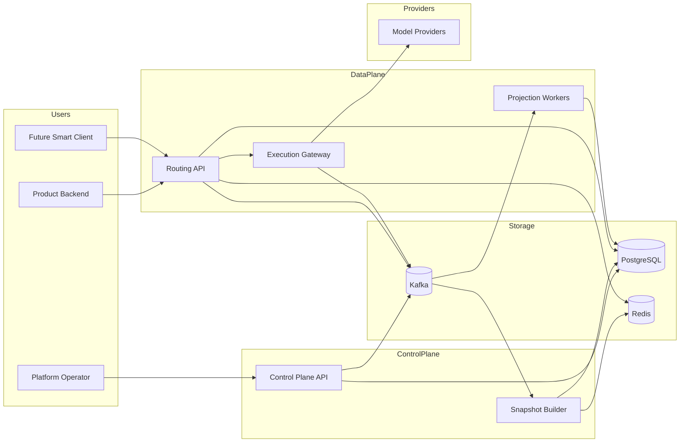
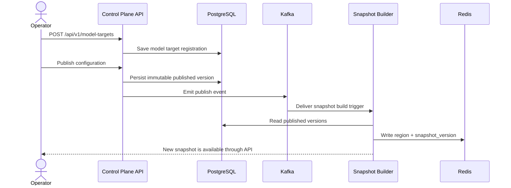
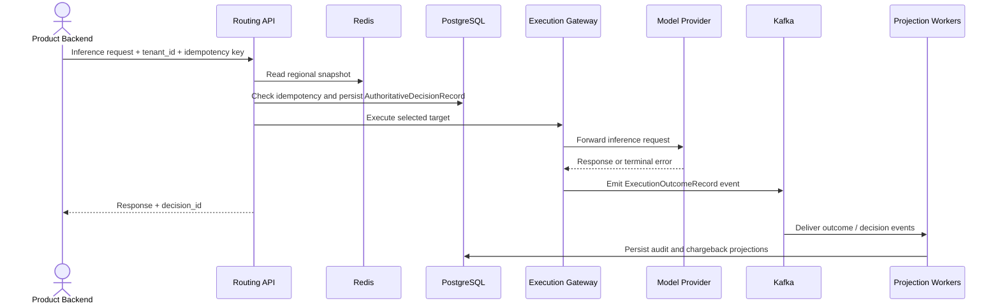
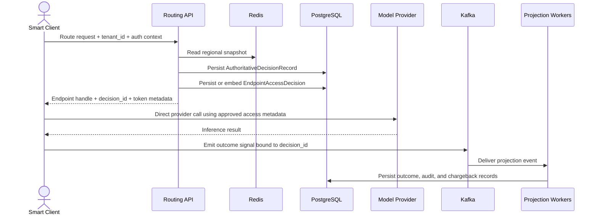

# Example Model Routing

A Docker-first, open source reference project for multi-tenant model routing and policy control. The system provides:

- API-managed control-plane workflows for model registration, routing policy, and experiment publication
- deterministic request-time routing against explicit regional snapshots
- immutable routing-time decision records for replay and audit
- asynchronous execution outcome, audit, and chargeback projections
- a V1 platform-proxy execution path with a planned future smart-client primary path

The governed system specification lives in [`SpecRepo/README.md`](SpecRepo/README.md).

The intended production-style deployment target is Kubernetes on DigitalOcean. Local development remains Docker Compose-first.

## Architecture Overview



## User Flows

### 1. Operator Adds a Model and Publishes a Route



### 2. Inference Request Through Platform Proxy in V1



### 3. Future Smart-Client Endpoint Access Flow



## Local Development Baseline

The intended local runtime is Docker Compose. The baseline stack is:

- `control-plane-api`: FastAPI
- `routing-api`: FastAPI
- `execution-gateway`: FastAPI
- `snapshot-worker`: Python worker
- `projection-worker`: Python worker
- `postgres`: durable metadata and decision store
- `redis`: regional snapshot cache
- `kafka`: event bus and projection fanout
- `keycloak`: optional local identity provider for end-to-end auth flows

## Canonical Submission Endpoint

Model submission to the control plane uses:

- `POST /api/v1/model-targets`

Minimum request fields:

- `model_name`
- `provider`
- `provider_model_id`
- `serving_adapter`
- `endpoint_url` or provider connection reference
- owning team or tenant metadata required for governance

Response expectations:

- `model_target_id`
- assigned `model_version`
- initial publish-eligibility or validation status
- validation result reference or status link

Versioning rule:

- `model_version` is assigned by the control plane, not by the caller
- it must be a monotonically increasing number per `model_name`

## Canonical Promotion Endpoint

Production promotion uses:

- `POST /api/v1/model-targets/{model_target_id}:promote`

Minimum request intent:

- identify the production route, surface, or policy context that should use the target

Response expectations:

- `model_target_id`
- assigned `model_version`
- promotion status
- promotion record reference

Synchronous orchestration behavior:

- the promote call synchronously invokes routing-policy publish for the affected production context
- it returns success only after the routing policy is published and the current snapshot state is available for routing

## Canonical Routing Publish Endpoint

Routing-policy publication uses:

- `POST /api/v1/routing-policies/{policy_id}:publish`

This endpoint persists a new immutable routing policy version and triggers snapshot construction and distribution.

## Canonical Current Snapshot Endpoint

Current snapshot lookup uses:

- `GET /api/v1/snapshots/{region}/current`

This endpoint returns the current snapshot version and staleness metadata for the requested region.

## Canonical Experiment Endpoints

Experiment management is API-driven:

- `POST /api/v1/experiments`
- `PATCH /api/v1/experiments/{experiment_id}`
- `POST /api/v1/experiments/{experiment_id}:publish`
- `GET /api/v1/experiments/{experiment_id}`

These endpoints create, update, publish, and inspect experiment configuration used by routing.

## Canonical Route Mapping Endpoints

Route management is API-driven:

- `POST /api/v1/routes`
- `PATCH /api/v1/routes/{route_id}`
- `GET /api/v1/routes/{route_id}`

These endpoints create and maintain the mapping between inference routes, policies, and eligible model targets.

## Canonical Decision Inspection Endpoint

Routing-decision inspection uses:

- `GET /api/v1/decisions/{decision_id}`

This endpoint returns the authoritative decision record and the version identifiers needed for replay and audit.

## Canonical Projection Status Endpoint

Projection inspection uses:

- `GET /api/v1/decisions/{decision_id}/projections`

This endpoint returns execution, audit, and chargeback projection status for the specified decision.

## Canonical Training Endpoints

Repo-owned model training is API-driven:

- `POST /api/v1/training-jobs`
- `GET /api/v1/training-jobs/{training_job_id}`

The create endpoint starts a training job for a supported feature group. The read endpoint returns job status, artifact references, and any resulting registry linkage.

## Canonical Model Registry Endpoints

Registry inspection is API-driven:

- `GET /api/v1/model-registry/{feature_group}/latest`
- `GET /api/v1/model-registry/{feature_group}/versions`

These endpoints expose the currently selected manifest and historical registry entries for repo-owned models.

## Canonical Parity Inspection Endpoint

Serving parity inspection uses:

- `GET /api/v1/parity/customer-online/{customer_id}`

This endpoint returns the expected online record, the actual Redis record, and field-level mismatches for the customer realtime path.

## Deployment Baseline

The intended non-local deployment target is DigitalOcean Kubernetes.

Required namespaces:

- `platform-system`: ingress controller and shared cluster support components for this stack
- `model-routing-control-plane`: control-plane API
- `model-routing-data-plane`: routing API, execution gateway, snapshot worker, and projection worker
- `model-routing-data`: PostgreSQL, Redis, Kafka, and Keycloak when self-managed in-cluster

Baseline container ports:

- `control-plane-api`: `8003`
- `routing-api`: `8004`
- `execution-gateway`: `8005`
- `postgres`: `5432`
- `redis`: `6379`
- `kafka`: `9092`
- `keycloak`: `8083`

Exposure model:

- `control-plane-api` and `routing-api` are exposed through Kubernetes ingress on HTTPS `443`
- `execution-gateway`, workers, databases, cache, Kafka, and Keycloak remain internal by default

Node placement:

- the DigitalOcean Kubernetes cluster includes a dedicated GPU node pool named `gpu-nodepool`
- GPU nodes are tainted so pods do not land on them by default
- only inference-serving pods that execute model inference tolerate the GPU taint and schedule onto `gpu-nodepool`
- control-plane API, routing API, workers, storage, feature services, and supporting infrastructure remain on the default non-GPU node pool
- no non-inference workload in this repo may target `gpu-nodepool`

Image policy:

- third-party infrastructure images must be pulled from upstream vendor or project registries
- do not rely on custom-built, forked, or internally mirrored infrastructure images
- first-party service images must use upstream base images
- avoid introducing a private image registry dependency unless it becomes strictly necessary for first-party application delivery

## Baseline Directory Structure

```text
.
├── README.md
├── AGENTS.md
├── docker-compose.yml
├── SpecRepo/
│   ├── README.md
│   ├── PROBLEM.md
│   ├── INVARIANTS.md
│   ├── REQUIREMENTS.md
│   ├── DATA_MODEL.md
│   ├── CONSISTENCY.md
│   └── ARCHITECTURE.md
├── apps/
│   ├── control-plane-api/
│   │   ├── app/
│   │   ├── tests/
│   │   └── pyproject.toml
│   ├── routing-api/
│   │   ├── app/
│   │   ├── tests/
│   │   └── pyproject.toml
│   └── execution-gateway/
│       ├── app/
│       ├── tests/
│       └── pyproject.toml
├── workers/
│   ├── snapshot-worker/
│   └── projection-worker/
├── packages/
│   ├── schemas/
│   └── client-sdk/
├── infra/
│   ├── docker/
│   ├── migrations/
│   ├── kafka/
│   └── keycloak/
└── scripts/
    ├── dev/
    └── seed/
```

## API Management Baseline

Operator management workflows are API-only. The control-plane API should support at least:

- create and register model targets through `POST /api/v1/model-targets`
- assign one or more models to an inference route through `POST/PATCH /api/v1/routes...`
- configure experiment and routing rules through `POST/PATCH /api/v1/experiments...` and route APIs
- publish immutable versions through `POST /api/v1/experiments/{experiment_id}:publish` and `POST /api/v1/routing-policies/{policy_id}:publish`
- inspect routing decisions by `GET /api/v1/decisions/{decision_id}`
- inspect snapshot version and staleness by `GET /api/v1/snapshots/{region}/current`
- inspect projection status by `GET /api/v1/decisions/{decision_id}/projections`
- trigger and inspect training by `POST/GET /api/v1/training-jobs...`
- inspect model registry state by `GET /api/v1/model-registry/...`
- inspect customer online parity by `GET /api/v1/parity/customer-online/{customer_id}`

## Technology Baseline

Open source defaults for the initial build:

- Backend APIs and workers: Python, FastAPI, Pydantic
- Database: PostgreSQL
- Cache: Redis
- Messaging: Kafka
- Identity: Keycloak
- Local orchestration: Docker Compose
- Non-local deployment target: DigitalOcean Kubernetes

## Notes

- V1 execution goes through the platform proxy.
- The architecture is intentionally prepared for smart-client endpoint access to become the primary path later.
- The spec under `SpecRepo/` is the source of truth when implementation details drift.
