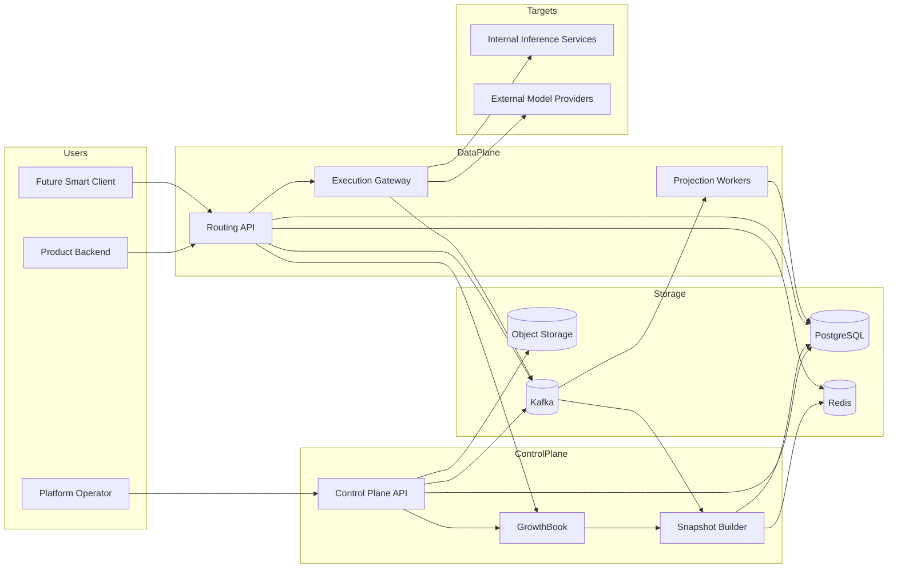
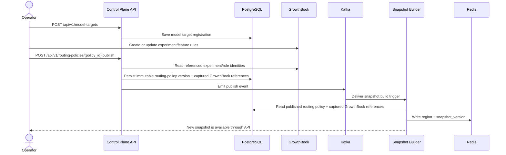
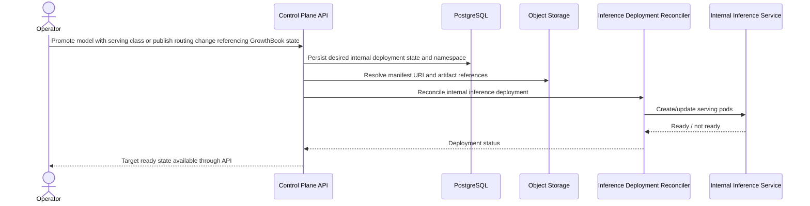
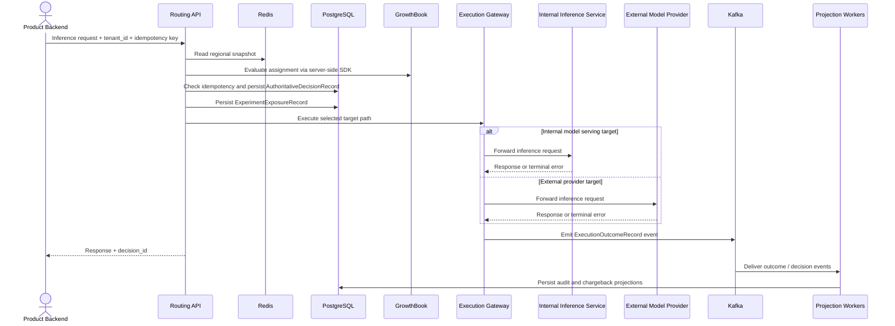
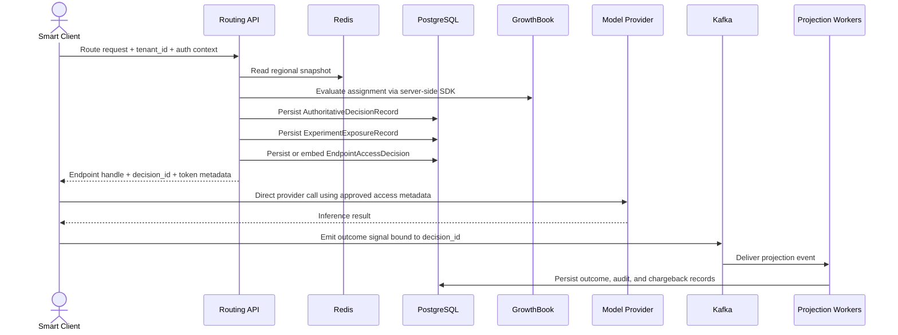

# Example Model Routing

An open source reference project for a lean, multi-tenant AI platform designed to run on Kubernetes in DigitalOcean. The system provides:

- API-managed control-plane workflows for model target registration and routing policy publication, with GrowthBook-managed routing experiments
- Kubeflow-managed ML pipelines, model training, ML experiment tracking, and model deployment workflows
- deterministic request-time routing against explicit regional snapshots
- immutable routing-time decision records for replay and audit
- asynchronous execution outcome, audit, and chargeback projections
- model artifacts stored in object storage and referenced by metadata stores rather than embedded in the relational database
- a V1 platform-proxy execution path with a planned future smart-client primary path
- readiness-gated internal inference rollout with required promotion-time regular vs GPU-backed namespace selection
- prompt, agent, and MCP capability lifecycle governance under the same API-managed platform contract

The governed system specification lives in [`SpecRepo/README.md`](SpecRepo/README.md).

The required deployment target is Kubernetes in DigitalOcean. The architecture is intentionally portable enough that optional cloud adapters may be added later, but DigitalOcean remains the authoritative baseline environment.

## Architecture Overview



## User Flows

### 1. Operator Adds a Model and Publishes a Route



### 1A. Promotion Or Experiment Rollout Creates Internal Inference Pods



### 2. Inference Request Through Platform Proxy in V1



### 3. Future Smart-Client Endpoint Access Flow



## Kubernetes Baseline

The required runtime is Kubernetes in DigitalOcean. The baseline stack is:

- `control-plane-api`: FastAPI
- `routing-api`: FastAPI
- `execution-gateway`: FastAPI
- `inference-deployment-reconciler`: controller that creates or updates internal inference-serving workloads
- `snapshot-worker`: Python worker
- `projection-worker`: Python worker
- `postgres`: reused existing PostgreSQL service for durable metadata, decision store, and internal inference deployment state
- `object-storage`: reused existing MinIO-compatible artifact store for model binaries, manifests, datasets, and metrics
- `redis`: regional snapshot cache
- `kafka`: reused existing Kafka service for event bus and projection fanout
- Kubernetes-native secrets, config maps, and service accounts for initial application configuration and secret delivery
- GitOps-managed Keycloak realm, client, and bootstrap manifests as the bridge until a fuller security system is available
- application-native health and structured logging for the initial operational baseline

## Shared Resource Reuse

The deployment model is mandatory reuse of prerequisite platform resources that already exist in DigitalOcean for `../example-data-pipeline-w-ml`. This repo must add to those resources instead of creating duplicate platform services.

Required shared resources:

- PostgreSQL
- MinIO-compatible object storage
- Kafka
- Kafka Connect
- Iceberg
- Schema Registry
- dbt

This means:

- new schemas instead of new Postgres clusters
- new buckets or prefixes instead of new object stores
- new topics and connectors instead of new Kafka clusters
- new Iceberg namespaces and tables instead of new catalogs
- new dbt projects, packages, models, or selectors instead of a second analytics foundation

New dedicated resources should only be introduced when isolation, security, lifecycle, or capacity requirements make reuse impossible.

## Platform Positioning

This repository now represents a lean AI platform baseline rather than only a routing control plane. In addition to routing and repo-owned model workflows, the governed scope includes:

- regular and GPU-backed internal inference namespace governance
- prompt and agent version lifecycle
- hosted MCP service lifecycle and tool-binding governance
- tenant-aware usage and cost attribution

The initial build requires Keycloak for identity and access control. Until a fuller security system is available, Keycloak must be populated through GitOps-managed manifests as the bridge pattern. External Secrets, service mesh, OpenTelemetry, Prometheus, Loki, and Tempo/Jaeger may be layered on later without changing the core API and data contracts.

## Storage Model

Storage responsibilities are split deliberately:

- PostgreSQL stores relational metadata, configuration, decisions, derived records, and authoritative internal inference deployment desired and observed state
- object storage stores model binaries, manifests, datasets, and evaluation artifacts
- Redis stores hot routing and feature-serving state
- Kafka carries asynchronous events

Model artifacts are not treated as primary relational database payloads.

## Execution Model

Execution is split into selection and target dispatch:

- `Routing API` decides which target should handle the request
- `Execution Gateway` dispatches execution traffic either to:
  - internally hosted inference services for models served by this platform
  - external model providers for provider-hosted models

The execution gateway is therefore not provider-only. It is the execution router across internal and external inference targets.

Internal inference services may be created or updated by API-driven control-plane actions through a deployment reconciler. In other words, promotion or experiment rollout can result in serving pods being created before traffic is admitted.

Internal inference deployments are partitioned by serving class. Model promotion must pass `serving_class=regular` or `serving_class=gpu_backed`; the control plane derives the Kubernetes namespace from that choice. `regular` is the baseline path and schedules on non-GPU nodes. `gpu_backed` uses the GPU inference namespace and only becomes routable when GPU capacity and quota are configured and proven.

## Canonical Submission Endpoint

Routable target registration to the control plane uses:

- `POST /api/v1/model-targets`

Minimum request fields:

- `model_name`
- `provider`
- `provider_model_id`
- `serving_adapter`
- `endpoint_url` or provider connection reference
- owning team or tenant metadata required for governance

Response expectations:

- `model_target_id`
- target registration status
- initial publish-eligibility or validation status
- validation result reference or status link

Versioning rule:

- repo-owned `model_version` lifecycle is governed separately through the model registry and promotion APIs

## Additional Governed APIs

The control plane also governs:

- prompt lifecycle through `POST /api/v1/prompts`
- agent lifecycle through `POST /api/v1/agents`
- MCP capability registration and inspection through control-plane APIs
- internal inference deployment state through `/api/v1/inference-deployments...`
- Kubeflow-backed training and deployment workflow initiation and inspection through training and model lifecycle APIs

## Canonical Promotion Endpoint

Repo-owned production promotion uses:

- `POST /api/v1/model-registry/{feature_group}/versions/{model_version}:promote`

Minimum request intent:

- pass the required serving class:
  - `regular`
  - `gpu_backed`
- identify the production route, surface, or policy context that should use the version
- for `gpu_backed`, identify or resolve the governed GPU compute pool or capacity reference

Response expectations:

- `feature_group`
- `model_version`
- resolved serving class and inference namespace
- deployment identifier when internal serving is required
- promotion status
- promotion record reference

Synchronous orchestration behavior:

- the promote call synchronously invokes routing-policy publish for the affected production context
- for internal inference targets, production activation requires a ready deployment in the namespace derived from the promotion serving class
- it returns success only after the routing policy is published and the current snapshot state is available for routing

## Canonical Routing Publish Endpoint

Routing-policy publication uses:

- `POST /api/v1/routing-policies/{policy_id}:publish`

This endpoint persists a new immutable routing policy version and triggers snapshot construction and distribution.

## Canonical Current Snapshot Endpoint

Current snapshot lookup uses:

- `GET /api/v1/snapshots/{region}/current`

This endpoint returns the current snapshot version and staleness metadata for the requested region.

## Canonical Experiment Management

Experiment management is split explicitly:

- GrowthBook owns feature flags, A/B testing, experiment analysis, and decision rollout control.
- Kubeflow owns ML pipelines, model training, ML experiment tracking, and model deployment workflows.

This repo consumes referenced GrowthBook experiment, feature, rule, phase, and bucket-version identities during routing-policy publication and routing-time evaluation.

Kubeflow tracking in this repo refers to ML experiments and workflow lineage, not user-facing A/B tests.

## Canonical Route Mapping Endpoints

Route management is API-driven:

- `POST /api/v1/routes`
- `PATCH /api/v1/routes/{route_id}`
- `GET /api/v1/routes/{route_id}`

These endpoints create and maintain the mapping between inference routes, policies, and eligible model targets.

## Canonical Decision Inspection Endpoint

Routing-decision inspection uses:

- `GET /api/v1/decisions/{decision_id}`

This endpoint returns the authoritative decision record and the version identifiers needed for replay and audit.

## Canonical Projection Status Endpoint

Projection inspection uses:

- `GET /api/v1/decisions/{decision_id}/projections`

This endpoint returns execution, audit, and chargeback projection status for the specified decision.

## Canonical Training Endpoints

Repo-owned model training is API-driven:

- `POST /api/v1/training-jobs`
- `GET /api/v1/training-jobs/{training_job_id}`

The create endpoint starts a training job for a supported feature group. The read endpoint returns job status, artifact references, and any resulting registry linkage.

## Canonical Model Registry Endpoints

Registry inspection is API-driven:

- `GET /api/v1/model-registry/{feature_group}/latest`
- `GET /api/v1/model-registry/{feature_group}/versions`
- `GET /api/v1/model-registry/{feature_group}/versions/{model_version}`
- `POST /api/v1/model-registry/{feature_group}/versions/{model_version}:promote`
- `POST /api/v1/model-registry/{feature_group}/versions/{model_version}:deprecate`
- `POST /api/v1/model-registry/{feature_group}/versions/{model_version}:retire`

These endpoints expose the currently selected manifest and historical registry entries for repo-owned models.

## Canonical Parity Inspection Endpoint

Serving parity inspection uses:

- `GET /api/v1/parity/customer-online/{customer_id}`

This endpoint returns the expected online record, the actual Redis record, and field-level mismatches for the customer realtime path.

## Deployment Baseline

The required deployment target is DigitalOcean Kubernetes.

Required namespaces:

- `platform-system`: ingress controller and shared cluster support components for this stack
- `model-routing-control-plane`: control-plane API
- `model-routing-data-plane`: routing API, execution gateway, snapshot worker, and projection worker
- `model-routing-inference-regular`: internal inference-serving workloads promoted with `serving_class=regular`
- `model-routing-inference-gpu`: internal inference-serving workloads promoted with `serving_class=gpu_backed`
- `model-routing-data`: Redis and Keycloak when self-managed in-cluster; reused PostgreSQL, object storage, and Kafka services are consumed from the existing platform footprint instead of duplicated here

Baseline container ports:

- `control-plane-api`: `8003`
- `routing-api`: `8004`
- `execution-gateway`: `8005`
- `postgres`: `5432`
- `object-storage`: `9000`
- `redis`: `6379`
- `kafka`: `9092`
- `keycloak`: `8083`

Exposure model:

- `control-plane-api` and `routing-api` are exposed through Kubernetes ingress on HTTPS `443`
- `execution-gateway`, workers, databases, object storage, cache, Kafka, and Keycloak remain internal by default

Keycloak bootstrap posture:

- Keycloak realm configuration, clients, roles, redirect URIs, and bootstrap bindings must be declared through GitOps-managed manifests
- GitOps is the temporary bridge for identity population until a dedicated security platform is available
- bootstrap admin passwords, service-account secrets, and client secrets must never be committed to Git in plaintext
- those credentials must be generated from high-entropy random material and stored only as encrypted secret manifests or equivalent protected GitOps inputs
- generated passwords and secrets should provide at least `32` random bytes of entropy or equivalent cryptographic strength

Node placement:

- the baseline deployment does not require GPU capacity
- `regular` inference workloads run in `model-routing-inference-regular` on non-GPU nodes
- if a dedicated GPU node pool is provisioned, GPU nodes are tainted so pods do not land on them by default
- only inference-serving pods in `model-routing-inference-gpu` may tolerate the GPU taint or select GPU nodes
- promotions that request `serving_class=gpu_backed` remain pending or failed until GPU capacity and quota are configured
- control-plane API, routing API, workers, storage, feature services, and supporting infrastructure remain on the default non-GPU node pool
- no non-inference workload in this repo may target `gpu-nodepool`

Image policy:

- third-party infrastructure images must be pulled from upstream vendor or project registries
- do not rely on custom-built, forked, or internally mirrored infrastructure images
- first-party service images must use upstream base images
- avoid introducing a private image registry dependency unless it becomes strictly necessary for first-party application delivery

## Baseline Directory Structure

```text
.
├── README.md
├── AGENTS.md
├── SpecRepo/
│   ├── README.md
│   ├── PROBLEM.md
│   ├── INVARIANTS.md
│   ├── REQUIREMENTS.md
│   ├── DATA_MODEL.md
│   ├── CONSISTENCY.md
│   └── ARCHITECTURE.md
├── apps/
│   ├── control-plane-api/
│   │   ├── app/
│   │   ├── tests/
│   │   └── pyproject.toml
│   ├── routing-api/
│   │   ├── app/
│   │   ├── tests/
│   │   └── pyproject.toml
│   └── execution-gateway/
│       ├── app/
│       ├── tests/
│       └── pyproject.toml
├── workers/
│   ├── snapshot-worker/
│   └── projection-worker/
├── packages/
│   ├── schemas/
│   └── client-sdk/
├── infra/
│   ├── docker/
│   ├── migrations/
│   ├── kafka/
│   └── keycloak/
└── scripts/
    ├── dev/
    └── seed/
```

## API Management Baseline

Operator management workflows are API-only. The control-plane API should support at least:

- create and register model targets through `POST /api/v1/model-targets`
- promote repo-owned model versions through `POST /api/v1/model-registry/{feature_group}/versions/{model_version}:promote` with an explicit `regular` or `gpu_backed` serving-class decision
- assign one or more models to an inference route through `POST/PATCH /api/v1/routes...`
- configure experiments in GrowthBook and route bindings through route and routing-policy APIs
- publish immutable routing-policy versions through `POST /api/v1/routing-policies/{policy_id}:publish`
- inspect routing decisions by `GET /api/v1/decisions/{decision_id}`
- inspect snapshot version and staleness by `GET /api/v1/snapshots/{region}/current`
- inspect projection status by `GET /api/v1/decisions/{decision_id}/projections`
- trigger and inspect training by `POST/GET /api/v1/training-jobs...`
- inspect model registry state by `GET /api/v1/model-registry/...`
- inspect customer online parity by `GET /api/v1/parity/customer-online/{customer_id}`

## Technology Baseline

Open source defaults for the initial build:

- Backend APIs and workers: Python, FastAPI, Pydantic
- ML workflow orchestration: Kubeflow for pipelines, training workflows, ML experiment tracking, and deployment workflows
- Database: reused PostgreSQL
- Object storage: reused MinIO-compatible S3 API
- Cache: Redis
- Messaging: reused Kafka
- Identity and auth baseline: Keycloak plus Kubernetes-native delivery and integration mechanisms
- Secrets baseline: GitOps-delivered encrypted secret manifests plus Kubernetes-native secret delivery, with no plaintext credentials committed to Git
- Operational baseline: application health endpoints and structured logs
- Deployment target: DigitalOcean Kubernetes

## Notes

- V1 execution goes through the platform proxy.
- The architecture is intentionally prepared for smart-client endpoint access to become the primary path later.
- The spec under `SpecRepo/` is the source of truth when implementation details drift.
